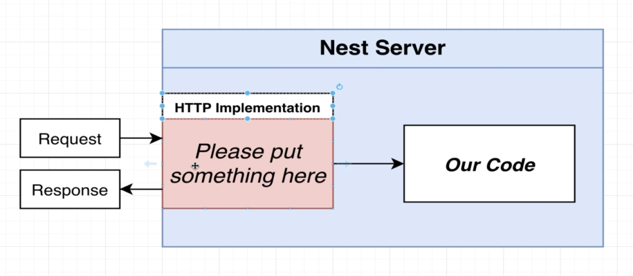
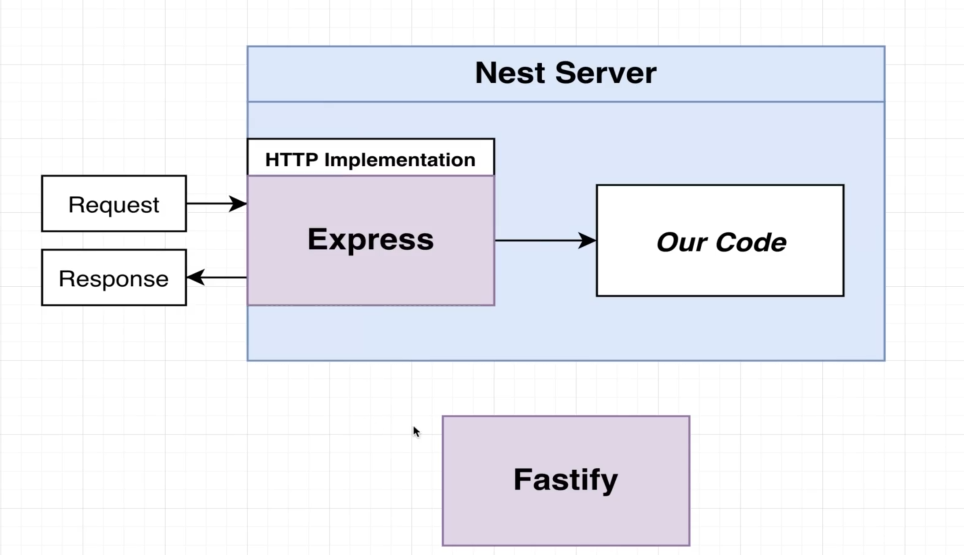
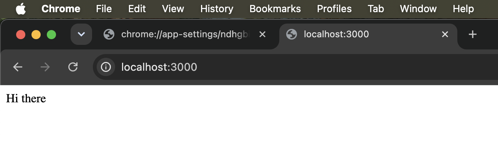

# Basics of Nest

- [Basics of Nest](#basics-of-nest)
  - [Project Setup](#project-setup)
  - [Understanding `package.json`](#understanding-packagejson)
  - [Setup Typescript compiler settings](#setup-typescript-compiler-settings)
    - [Parts of Nest](#parts-of-nest)
  - [Creating a Module and Controller](#creating-a-module-and-controller)
  - [File naming conventions (separating the Module and Controller)](#file-naming-conventions-separating-the-module-and-controller)
    - [Conventions](#conventions)
  - [Routing Decorators](#routing-decorators)

## Project Setup

1. We will first install `Nest CLI` tool
   1. For generating and running projects.
   2. But, before that we will learn to create a Nest project from scratch
2. Why from scratch?
   1. The first project will be a little bit challenging
   2. We are going to focus on some behind-the-scenes stuff
   3. Understanding how Nest works internally will make all of Nest easy
3. We will first create a directory named `scratch` and run the command
   1. `pnpm init -y`
4. Install a couple of dependencies for Nest.
   1. They are, `pnpm install @nestjs/common@7.6.17 @nestjs/core@7.6.17 @nestjs/platform-express@7.6.17 reflect-metadata@0.1.13 typescript@4.3.2`

## Understanding `package.json`

Our dependencies are listed as follows:

```typescript
"dependencies": {
   "@nestjs/common": "7.6.17",
   "@nestjs/core": "7.6.17",
   "@nestjs/platform-express": "7.6.17",
   "reflect-metadata": "0.1.13",
   "typescript": "4.3.2"
}
```

Here is what they are:

The Nest library itself is split into a couple of packages.

1. `@nestjs/common`
   1. This package contains a vast majority of the functions, classes, etc that we need from Nest
2. `@nestjs/platform-express`
   1. This let's Nest use ExpressJS for handling HTTP requests
   2. Nest itself does not handle incoming requests.
   3. Nest relies on some outside implementation to handle the incoming HTTP requests.

See this diagram. 

The HTTP implementation needs to be provided.

In NestJS there are two options for the HTTP implementation.

1. Express (default) 
2. Fastify

As to why we would use one over the other, depends on what kind of application we are building. We will stick to Express for this project



`@nestjs/platform-express` indicates that we want to use the ExpressJS adapter with NestJS and behind the scenes it provides the implementation to NestJS for handling request/response.

3. `reflect-metadata`
   1. Helps make decorators work.
4. `typescript`
   1. We write Nest apps in Typescript.

For setting up the NestJS app from scratch we need to follow these steps.

1. Install deps
2. Setup Typescript compiler settings
3. Create a Nest module and controller
4. Start the app!

## Setup Typescript compiler settings

We will be setting up the `tsconfig.json` file.

We do not have to do Steps 1 and 2 if we are using the Nest CLI app. Since we are doing this from scratch we need to do this.

```typescript
// file: tsconfig.json

{
  "compilerOptions": {
    "module": "commonjs",
    "target": "es2017",
    "experimentalDecorators": true,
    "emitDecoratorMetadata": true
  }
}
```

Any server has this flow diagram. It has a Request-Response cycle.

1. Request
2. Code to process the request in some way, then respond to it
   1. This part will always have the same set of steps in every code that we write.
   2. Just about every server will more or less have same set of steps.
   3. Some steps may be omitted, like authentication for public facing routes, but there will be more of less the same.
   4. For doing the below jobs, Nest has tools to help us write these.
   5. They are,
      1. Validate the data contained in the request
         1. Nest Tool: Pipe
         2. Helps us validate incoming data
      2. Make sure the user is authenticated
         1. Nest Tool: Guard
         2. Incoming requests are coming from authenticated or authorized users or applications
      3. Route the request to a particular function
         1. Nest Tool: Controller
         2. Controllers contain routing logic.
      4. Run some business logic
         1. Nest Tool: Service
         2. This contains business logic
      5. Access a database
         1. Nest Tool: Repository
         2. Abstraction over the repository
3. Response
   1. Finally response.

The request-response cycle always has the same steps.

The tools offered by Nest helps us deal with some form of incoming requests.

### Parts of Nest

Apart from the Nest tool discussed above, there are more tools provided by Nest.

1. Controllers
   1. Handles incoming requests
2. Services
   1. Handles data access and business logic
3. Modules
   1. Groups together code
4. Pipes
   1. Validates incoming data
5. Filters
   1. Handles errors that occur during request handling
6. Guards
   1. Handles authentication
7. Interceptors
   1. Adds extra logic to incoming requests or outgoing responses
8. Respositories
   1. Handles data stored in DB

Controllers and Modules are common in all NestJS applications. Every Nest application will have at least one 1 module and 1 controller.

## Creating a Module and Controller

`main.ts` is the entry point to any Nest app, to listen for traffic on a particular port.

Usually Modules and Controllers are present in their own seprate files, but for the ease of explanation we
will put in the same file.

```typescript
// file: src/main.ts

// Tools that Nest provides to make a controller
// and module

// Get helps us create handlers that respond to
// HTTP method of GET
import { Controller, Module, Get } from '@nestjs/common';
// In 95% from all import statemetns we write
// we will importing from @nestjs/common.

// Only inside the main.ts we import nestjs/core
import { NestFactory } from '@nestjs/core';

// @Controller() is a decorator
// This specifies to Nest that we will be using this
// class as a controller
// We will be using the decorators quite heavily
@Controller()
class AppController {
  // Each method inside a controller handles
  // one route inside the application

  // To handle GET request to the root route
  @Get('/')
  getRootRoute() {
    return 'Hi there';
  }
}

// A module wraps a controller

// When Nest sees a controller class defined
// within the module, it will go ahead and
// create instance of all the controller classes
// Then it will take a look at all the decorators
// used inside the controller, and set up route handlers
// for each one of them
@Module({
  controllers: [AppController],
})
class AppModule {}

// This is the function that runs at the startup of
// the app. It is a common convention to name this
// function bootstrap()
async function bootstrap() {
  // Here we create a new Nest application
  // of our module
  const app = await NestFactory.create(AppModule);

  await app.listen(3000);
}

// This will create an instance of our application
// and tell it to listen for incoming traffic
bootstrap();
```

To run this app we use the following command

```bash
tsx src/main.ts
```

But later on we will use the Nest CLI command to run the tool.

This will be the output when we visit `localhost:3000`



## File naming conventions (separating the Module and Controller)

Right now we have this.

1. `main.ts`
   1. `class AppController`
   2. `class AppModule`
   3. `function bootstrap`

We should follow this convention.

1. `main.ts`
   1. `function bootstrap`
2. `app.controller.ts`
   1. `class AppController`
   2. AppController --> app.controller
3. `app.module.ts`
   1. `class AppModule`
   2. AppModule --> app.module

### Conventions

1. One class per file (som exceptions)
2. Class names should include the kind of thing we are creating
3. Name of class and name of file should always match up
4. Filename template:
   1. `name`.`type_of_thing`.`ts`

After, the changes are as follows:

```typescript
// file: app.controller.ts

import { Controller, Get } from '@nestjs/common';

// @Controller() is a decorator
// This specifies to Nest that we will be using this
// class as a controller
// We will be using the decorators quite heavily
@Controller()
class AppController {
  // Each method inside a controller handles
  // one route inside the application

  // To handle GET request to the root route
  //   @Get('/') <-- optional
  @Get() // <-- Also does the same
  getRootRoute() {
    return 'Hi there';
  }
}

export { AppController };
```

```typescript
// file: app.module.ts

import { Module } from '@nestjs/common';
import { AppController } from './app.controller';

// A module wraps a controller

// When Nest sees a controller class defined
// within the module, it will go ahead and
// create instance of all the controller classes
// Then it will take a look at all the decorators
// used inside the controller, and set up route handlers
// for each one of them
@Module({
  controllers: [AppController],
})
class AppModule {}

export { AppModule };
```

```typescript
// file: main.ts

// Only inside the main.ts we import nestjs/core
import { NestFactory } from '@nestjs/core';
import { AppModule } from './app.module';

// This is the function that runs at the startup of
// the app. It is a common convention to name this
// function bootstrap()
async function bootstrap() {
  // Here we create a new Nest application
  // of our module
  const app = await NestFactory.create(AppModule);

  await app.listen(3000);
}

// This will create an instance of our application
// and tell it to listen for incoming traffic
bootstrap();
```

To run the server, we still use `tsx src/main.ts`, no changes there, and we get the same output.

## Routing Decorators

If we add a path inside the Get controller then we will have to make request to that route

```typescript
// file: app.controller.ts

import { Controller, Get } from '@nestjs/common';

// @Controller() is a decorator
// This specifies to Nest that we will be using this
// class as a controller
// We will be using the decorators quite heavily
@Controller()
class AppController {
  // Each method inside a controller handles
  // one route inside the application

  // To handle GET request to the root route
  // @Get('/')

  @Get('/asdf')
  getRootRoute() {
    return 'Hi there';
  }
}

export { AppController };
```

The requests would need to be made to `/asdf`

If the controller has a path in the Controller decorator, then that path is prefixed to all the
route endpoints

```typescript
// file: app.controller.ts

import { Controller, Get } from '@nestjs/common';

// @Controller() is a decorator
// This specifies to Nest that we will be using this
// class as a controller
// We will be using the decorators quite heavily
@Controller('/app')
class AppController {
  // Each method inside a controller handles
  // one route inside the application

  // To handle GET request to the root route
  // @Get('/')

  @Get('/asdf')
  getRootRoute() {
    return 'Hi there';
  }
}

export { AppController };
```

The requests now needs to be sent to `/app/asdf`, and all the route decorators declared inside the controller would have the `/app` prefixed.

To use the Controller decorator we will use to define the high level routing rule.

```typescript
import { Controller, Get } from '@nestjs/common';

// @Controller() is a decorator
// This specifies to Nest that we will be using this
// class as a controller
// We will be using the decorators quite heavily
@Controller('/app')
class AppController {
  // Each method inside a controller handles
  // one route inside the application

  // To handle GET request to the root route
  // @Get('/')

  @Get('/asdf')
  getRootRoute() {
    return 'Hi there';
  }

  @Get('/bye')
  getByeThere() {
    return 'Bye there';
  }
}

export { AppController };
```

If we make a request to `/app/bye` then we get `Bye there`.