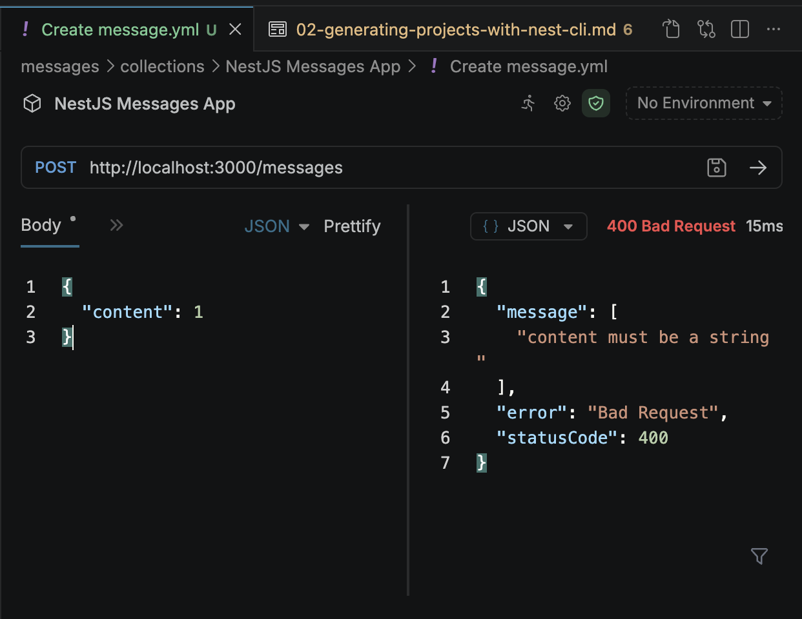
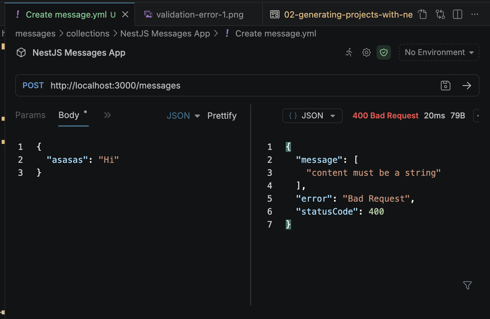
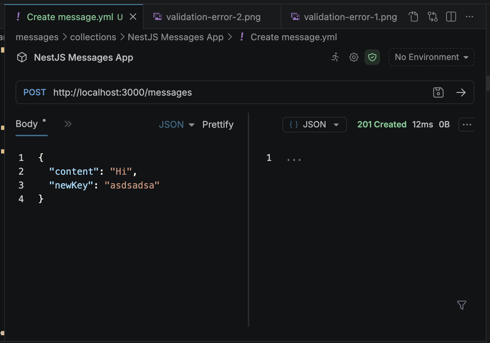

# Generating Projects with Nest CLI

- [Generating Projects with Nest CLI](#generating-projects-with-nest-cli)
  - [App Setup](#app-setup)
  - [What we will be building?](#what-we-will-be-building)
    - [Goal](#goal)
  - [Route 1: GET localhost:3000/messages (`Retrieve a list of all messages`)](#route-1-get-localhost3000messages-retrieve-a-list-of-all-messages)
  - [Route 2: POST localhost:3000/messages { "content" : "hi there" } (`Create a new message`)](#route-2-post-localhost3000messages--content--hi-there--create-a-new-message)
  - [Route 3: GET localhost:3000/messages/:id (`Retrieve a message with a particular ID`)](#route-3-get-localhost3000messagesid-retrieve-a-message-with-a-particular-id)
  - [Using Nest CLI to generate files](#using-nest-cli-to-generate-files)
  - [More on generating files](#more-on-generating-files)
    - [Anatomy of the `nest generate` command](#anatomy-of-the-nest-generate-command)
    - [Fixing TS Errors](#fixing-ts-errors)
  - [Adding Routing Logic](#adding-routing-logic)
    - [Option 1](#option-1)
    - [Option 2](#option-2)
  - [Accessing Request Data with Decorators](#accessing-request-data-with-decorators)
  - [Using Pipes for Validation](#using-pipes-for-validation)
  - [Adding Validation Rules](#adding-validation-rules)
    - [Setting up Automatic Validation](#setting-up-automatic-validation)
    - [Create a class that describes the different properties that the request body should have \& Add validation rules to the class](#create-a-class-that-describes-the-different-properties-that-the-request-body-should-have--add-validation-rules-to-the-class)
      - [Apply that class to the request handler](#apply-that-class-to-the-request-handler)
    - [Behind the Scenes of Validation](#behind-the-scenes-of-validation)
      - [What are DTOs (Data Transfer Object)s?](#what-are-dtos-data-transfer-objects)
        - [`class-transformer` package](#class-transformer-package)
        - [`class-validator` package](#class-validator-package)
        - [How did we add the class `CreateMessageDto` as a type and how did the Validation Pipe understood that type?](#how-did-we-add-the-class-createmessagedto-as-a-type-and-how-did-the-validation-pipe-understood-that-type)
        - [How is the type information preserved?](#how-is-the-type-information-preserved)
  - [Nest Architecture: Services and Repositories](#nest-architecture-services-and-repositories)
    - [Services](#services)
    - [Repositories](#repositories)
    - [`MessagesService`](#messagesservice)
    - [`MessageRepository`](#messagerepository)
    - [Implementing a Repository](#implementing-a-repository)
    - [Implementing a Service](#implementing-a-service)
    - [Reporting Errors with Exceptions](#reporting-errors-with-exceptions)
    - [Understanding Inversion of Control](#understanding-inversion-of-control)
      - [What is the Inversion of Control Principle?](#what-is-the-inversion-of-control-principle)
      - [Bad Code](#bad-code)
      - [Better Code](#better-code)
      - [Best Code](#best-code)
        - [Why would there be any other implementation besides the MessagesRepository implementation?](#why-would-there-be-any-other-implementation-besides-the-messagesrepository-implementation)
    - [Introduction to Dependency Injection](#introduction-to-dependency-injection)
      - [DI Container Flow](#di-container-flow)
    - [Refactor to Use Dependency Injection](#refactor-to-use-dependency-injection)
    - [How does Nest create a controller?](#how-does-nest-create-a-controller)
    - [What is the benefit?](#what-is-the-benefit)

## App Setup

We will generate a project using Nest CLI.

First we will install the Nest CLI globally.

```bash
npm install -g @nestjs/cli

# Do not use pnpm here, otherwise
# it gives error
```

To generate a new project, we will run

```bash
nest new <project-name>
```

First we have to select the package manager.

```bash
✨  We will scaffold your app in a few seconds..

? Which package manager would you ❤️  to use?
  npm
  yarn
❯ pnpm
```

After that if it fails due to the following reason

```bash
[ERR_PNPM_IGNORED_BUILDS] Ignored build scripts:
@nestjs/core@11.1.24
unrs-resolver@1.12.2

Run "pnpm approve-builds" to pick which dependencies should be allowed to run scripts.
```

Then run

```bash
pnpm approve-builds
```

Then the issue will be fixed.

## What we will be building?

### Goal

Store and retrieve messages stores in a plain JSON file.

We will have 3 routes.

1. List all messages saved
2. Retrieve message by id
3. Create a message

## Route 1: GET localhost:3000/messages (`Retrieve a list of all messages`)

All the steps that we take for any work.

1. [Nest Tool: Pipe] Validate the data contained in the request
2. [Nest Tool: Guard] Make sure the user is authenticated
3. [Nest Tool: Controller] Route the request to a particular function
4. [Nest Tool: Service] Run some business logic
5. [Nest Tool: Repository] Access a database

Steps that we need to take for the `GET /messages` route.

1. `[Nest Tool: Pipe]` Validate the data contained in the request
   1. No validation required here, so **skipped**.
2. `[Nest Tool: Guard]` Make sure the user is authenticated
   1. No authorization yet, so **skipped**.
3. `[Nest Tool: Controller]` Route the request to a particular function
   1. We will need a controller.
4. `[Nest Tool: Service]` Run some business logic
   1. This will also be needed since we need to obtain the data.
5. `[Nest Tool: Repository]` Access a database
   1. This will needed to represent the JSON DB file.

## Route 2: POST localhost:3000/messages { "content" : "hi there" } (`Create a new message`)

The data payload that we will be sending is

```json
{ 
  "content": "hi there" 
}
```

Steps that we need to take for the `POST /messages` route.

1. `[Nest Tool: Pipe]` Validate the data contained in the request
   1. This will be required, to validate if the body of the request has a content property that is a string.
   2. The string is not too long etc.
2. `[Nest Tool: Guard]` Make sure the user is authenticated
   1. No authorization yet, so **skipped**.
3. `[Nest Tool: Controller]` Route the request to a particular function
   1. We will need a controller.
4. `[Nest Tool: Service]` Run some business logic
   1. This will also be needed to create this message.
5. `[Nest Tool: Repository]` Access a database
   1. This will needed to represent the JSON DB file.

Note: Even though for the two requests we say that we need a controller, service and a repository for both the API's, it doesn't mean we will be creating a separate controller file per API endpoint.

There will be just one

1. Controller
2. Service
3. Repository

with different functions for the endpoints.

## Route 3: GET localhost:3000/messages/:id (`Retrieve a message with a particular ID`)

1. `[Nest Tool: Pipe]` Validate the data contained in the request
   1. May not be required. Could be used to validate the ID parameter though.
2. `[Nest Tool: Guard]` Make sure the user is authenticated
   1. No authorization yet, so **skipped**.
3. `[Nest Tool: Controller]` Route the request to a particular function
   1. We will need a controller.
4. `[Nest Tool: Service]` Run some business logic
   1. This will also be needed to access this message.
5. `[Nest Tool: Repository]` Access a database
   1. This will needed to represent the JSON DB file.

For the all three requests:

1. We do not need a guard (as of now).
2. But we do need a 
   1. Controller
      1. Name: `MessagesController.ts`
   2. Service
      1. Name: `MessagesService.ts`
   3. Repository
      1. Name: `MessagesRepository.ts`
3. We will also need a `Pipe` to validate the requests

We will also be creating a `Module` that will be wrapping up the

1. Controller
2. Service
3. Repository
4. Pipe
  
We will name this module `AppModule.ts`

## Using Nest CLI to generate files

To start the development server in watch mode we will be running the following command.

```bash
pnpm run start:dev
```

We also need to aware of the `.eslint.config.mjs` file.

By default, Nest makes use of ESLint.

This is a command line tool and automatically look at our code and highlight

1. Formatting issues
2. Other issues

Typescript already catches all of these issues.

We can disable ESLint by commenting out the content of the `*.mjs` file.

We already have files within the `/src` folder

1. `main.ts`
2. `app.controller.ts`
3. `app.module.ts`

Similar to the ones we built in /scratch.

We can absolutely use this AppModule to create our routes and controllers, but we want to see how these are wired up, so we remove the above files + `app.service.ts` file.

These will be created manually once to get the hang of it.

We will be creating the `MessagesModule`. We can create the module manually, or alternatively we can make use of the Nest CLI.

It will create different kinds of files for us with starter code. 

This will help us putting together a project very quickly.

To generate the files using Nest CLI, run the below command.

```bash
nest generate module <module-name-without-Module-suffix>
```

Example.

```bash
nest generate module Messages
```

When we run this command it creates a directory and the messages module.

```bash
src
├── main.ts
└── messages
    └── messages.module.ts
```

```typescript
// file: src/messages/messages.module.ts

import { Module } from '@nestjs/common';

@Module({})
export class MessagesModule {}
```

Note: If we pass the name with the `Module` suffix, to the Nest CLI command then the name of the class will be `MessagesModuleModule`

As soon as we will start adding the Controllers, Services etc, it will start adding the code automatically and it will save us a lot of time.

Let's hook this module in the `main.ts` file.

```typescript
// file: main.ts

import { NestFactory } from '@nestjs/core';
import { MessagesModule } from './messages/messages.module';

async function bootstrap() {
  const app = await NestFactory.create(MessagesModule);
  await app.listen(process.env.PORT ?? 3000);
}
bootstrap();
```

## More on generating files

Now we will creating the controllers using the Nest CLI application.

```bash
nest generate controller messages/messages --flat
```

Now it creates some new files.

```bash
src
├── main.ts
└── messages
    ├── messages.controller.spec.ts <-- NEW
    ├── messages.controller.ts <-- NEW
    └── messages.module.ts
```

Whenever we create a Controller, we need to add it to the list of controllers in the Module.

The CLI also connect some things for us.

```typescript
// file: src/messages/messages.controller.ts

import { Controller } from '@nestjs/common';

@Controller('messages')
export class MessagesController {}
```

```typescript
// file: src/messages/messages.module.ts

import { Module } from '@nestjs/common';
import { MessagesController } from './messages.controller';

@Module({
  controllers: [MessagesController]
})
export class MessagesModule {}
```

### Anatomy of the `nest generate` command

Structure

`nest generate <type-of-class-to-generate> <path/filename> --flat`

1. In `<type-of-class-to-generate>`, we can substitute
   1. `controller`
   2. `module`
   3. etc.
2. In `<path/filename>`,
   1. Ex. `messages/messages`
      1. First part dictates, Place the file in the `messages` folder
      2. Second part dictates, Call the class `messages`
3. `--flat`
   1. If we don't add in `--flat` then `nest generate` will create a folder called `controller` and place the files inside that
   2. Whether we create that folder or not is entirely upto us.

Without the `--flat` we will have this folder structure.

```bash
src
├── main.ts
└── messages
    ├── controllers
    │   ├── messages.controller.spec.ts
    │   └── messages.controller.ts
    └── messages.module.ts
```

We can keep this or undo it. I will keep it, since it keeps it organized.

If we start adding in route handlers inside the controllers it should start working.

### Fixing TS Errors

It may happen that if you open the `*.spec.ts` file, you see TS errors like `Cannot find name 'describe'`

To fix this run this command.

1. `pnpm add -D @types/jest`
   1. This adds the Jest type definition to the project.
2. Update the `tsconfig.json` file with

```json
{
  "compilerOptions": {
    "types": ["node", "jest"]
  }
}
```

This will fix the type errors.

## Adding Routing Logic

We have some options for routing.

There are three kinds of requests that we want to handle.

1. List all messages
   1. GET /messages request
2. Create a message
   1. POST /messages request
3. Get a particular message
   1. GET request with a path parameter

### Option 1

```typescript
@Controller()
export class MessagesController {
  @Get('/messages')
  listMessages() {...}

  @Post('/messages')
  createMessage() {...}

  @Get('/messages/:id')
  getMessage() {...}
}
```

We see that the `/messages` is the common prefix. So, we can move this `/messages` upto the `@Controller()`

### Option 2

```typescript
@Controller('/messages')
export class MessagesController {
  @Get()
  listMessages() {...}

  @Post()
  createMessage() {...}

  @Get('/:id')
  getMessage() {...}
}
```

When we add the path to the `@Controller('/messages')`, then it computes the path of each end-point by concatenating the outer path with the inner route handler path.

Therefore, the complete path for this becomes `/messages/:id`

```typescript
  @Get('/:id')
  getMessage() {...}
```

Option #2 is identical to Option #1, but it is more concise, no repetition.

The controller now looks like this.

```typescript
// file: src/messages/controllers/messages.controller.ts

import { Controller, Get, Post } from '@nestjs/common';

// The messages was automatically added by the Nest CLI
@Controller('messages')
export class MessagesController {
  @Get()
  listMessages() {}

  @Post()
  createMessage() {}

  @Get('/:id')
  getMessage() {}
}
```

## Accessing Request Data with Decorators

```typescript
@Get('/:id')
getMessage() {}
```

To extract the value of the path parameter, we need to make use of a couple of decorators.

How HTTP request works in general?

1. **HTML Request**
   1. Start line: POST `/messages/5?validate=true` HTTP/1.1
   2. `<Method> <URL> <HTTP Protocol Used>`
2. **Headers:**
   1. Host: localhost:3000
   2. Content-Type: application/json
3. **Body**
   1. `{"content": "hi there"}`

For each of these different parts of the HTTP request, Nest has different decorators for extracting them.

1. **HTML Request**
   1. Start line: POST `/messages/5?validate=true` HTTP/1.1
   2. `<Method> <URL> <HTTP Protocol Used>`
   3. `/messages/5?validate=true`
      1. `@Param('id)` --> gives the value 5 (path parameter)
         1. This denotes the wild card part of the URL that we want to access
      2. `@Query()` --> For the query string parameters
2. **Headers:**
   1. Host: localhost:3000
   2. Content-Type: application/json
   3. For the headers, we use the decorator `@Headers()`
3. **Body**
   1. `{"content": "hi there"}`
   2. For the body of the request, we use `@Body()`

All of these are different decorators that we can import from `@nestjs/common` library.

`@Body()` and `@Param()` are argument decorators whereas `@Post()` and `@Get()` are method decorators.

```typescript
// file: src/messages/controllers/messages.controller.ts

import { Controller, Get, Post, Body, Param } from '@nestjs/common';

@Controller('messages')
export class MessagesController {
  @Get()
  listMessages() {}

  @Post()
  createMessage(@Body() body: any) {
    console.log(body);
  }

  @Get('/:id')
  getMessage(@Param('id') id: string) {
    console.log(id);
  }
}
```

## Using Pipes for Validation

Inside of the POST request, we want to validate the incoming body.

We will use a Pipe to somehow reject the incoming request.

Requirement:

1. The body of the POST request should contain the `content` key.
2. The value of `content` should be a string.

The lifecyle is as follows:

1. Client makes a HTTP request `POST /messages` with `{"content": "hi there"}`
2. NestJS Tool: Pipe
   1. Validates request data before it reaches a route handler
   2. This guarantees that the code inside the route handler always gets a body that contains a property `content` with a value of `string`
3. Controller
   1. Route Handler

We can definately create Pipe's manually, but we can make use of the Pipes provided by Nest.

We will make use of `ValidationPipe`. This is a Pipe built in to Nest to make validation super easy.

For this, we will need to install two packages.

1. `pnpm i class-validator`
2. `pnpm i class-transformer`

To add the `ValidationPipe` to our NestJS app, we update the `main.ts` file like so.

```typescript
// file: src/main.ts
import { NestFactory } from '@nestjs/core';
import { MessagesModule } from './messages/messages.module';
import { ValidationPipe } from '@nestjs/common';

async function bootstrap() {
  const app = await NestFactory.create(MessagesModule);
  // We can either add the pipe to
  // one single route handler or add it globally across
  // all the routes.

  // The ValidationPipe will validate all the incoming
  // requests, that come to our application.

  // This doesn't mean we don't have to specify validation
  // rules. We will still need to add validation rules to
  // each route handler.

  // If the validation rules are not specified, then
  // ValidationPipe would not run on it.

  // We will only validate cetain routes.
  app.useGlobalPipes(new ValidationPipe());
  await app.listen(process.env.PORT ?? 3000);
}
bootstrap();
```

## Adding Validation Rules

To do this we will need to go through a series of steps.

### Setting up Automatic Validation

1. Tell Nest to use global validation
   1. This was done above, by wiring up the `ValidationPipe` in `main.ts`.
2. Below steps are needed to be added to each route handler separately.
   1. Create a class that describes the different properties that the request body should have
      1. This class is called a `Data Transfer Object`.
      2. This is often abbreviated as `Dto`
   2. Add validation rules to the class
   3. Apply that class to the request handler

### Create a class that describes the different properties that the request body should have & Add validation rules to the class

```typescript
// file: src/messages/dtos/create-message.dto.ts

import { IsString } from 'class-validator';

class CreateMessageDto {
  // Using ! we tell TS this property will be
  // assigned later. Don't you worry.
  // That gets rid of the error
  @IsString()
  content!: string;
}

export { CreateMessageDto };
```

#### Apply that class to the request handler

```typescript
// file: src/messages/controllers/messages.controller.ts

import { Controller, Get, Post, Body, Param } from '@nestjs/common';
import { CreateMessageDto } from '../dtos/create-message.dto';

@Controller('messages')
export class MessagesController {
  @Get()
  listMessages() {}

  @Post()
  // The type of the body parameter is set to the
  // class CreateMessageDto
  createMessage(@Body() body: CreateMessageDto) {
    console.log(body);
  }

  @Get('/:id')
  getMessage(@Param('id') id: string) {
    console.log(id);
  }
}
```

Now if we try to pass any invalid data to the this route, we will get a very nice descriptive error message as output without needing to write even a tiny bit of code.

Validation Error #1



Validation Error #2



Note, that additional keys are still accepted.

Validation Attempt #1



If we pass null or anything we will also get an error.

### Behind the Scenes of Validation

#### What are DTOs (Data Transfer Object)s?

The goal of Data Transfer Object is to carry data between two different places.

Sequence:

1. POST /messages { "content": "hi there" }
2. Data Transfer Object
   1. Carries data between two places
   2. They do not usually have any functionality tied to them.
   3. They are simple classes that list out a couple of different properties.
   4. A clear description of what some form of data may look like as it is being sent along with a request.
3. Route Handler

When add validation rules in our DTO we make use of two packages

1. `class-validator`
2. `class-transformer`

##### `class-transformer` package

[GitHub URL](https://github.com/typestack/class-transformer)

It is a package that helps convert data from one format to the other.

The goal of this package is to transform the data recieved and then turn them into instances of a class.

Consider the following data for example.

```json
[
   {
      "id": 1,
      "firstName": "Johnny",
      "lastName": "Cage",
      "age": 27
   },
   {
      "id": 2,
      "firstName": "Ismoil",
      "lastName": "Somoni",
      "age": 50
   },
   {
      "id": 3,
      "firstName": "Luke",
      "lastName": "Dacascos",
      "age": 12
   }
]
```

These are plain objects inside an array, they have no

1. Methods
2. No functionality tied with these objects.

The goal of the `class-transformer` package is to take those objects and turn them into instances of a class.

Example, once they are instances of a class, then we can associate properties and additional properties to them.

```typescript
export class User {
   id: number;
   firstName: string;
   lastName: string;
   age: number;

   getName() {
      return this.firstName + ' ' + this.lastName;
   }

   isAdult() {
      return this.age >= 18;
   }
}
```

Once we have instances, we can associate functions to these objects.

`class-transformers` is all about automating the process of transforming these plain JSON objects into much more fully features instances of a class.

##### `class-validator` package

[GitHub URL](https://github.com/typestack/class-validator)

This package has also been created by the same people who crated `class-transformer` package.

Validation Decorators.

1. Type Validation Decorator
2. and much more

Here is the full flow of the operation.

1. Request POST /messages `{"content": "hi there"}` comes
2. Validation Pipe Working
   1. Use `class-transformer` to turn the body into an instance of the DTO class
      1. Ex. `CreateMessageDto` class
      2. `class-transformer` is response for converting `{"content": "hi there"}` into an instance of the `CreateMessageDto` class.
   2. Use `class-validator` to validate the instance
      1. Ex. `@IsString(), @IsNumber()` etc.
   3. If there are any validaton errors, respond immediately, otherwise provide body to request handler.

##### How did we add the class `CreateMessageDto` as a type and how did the Validation Pipe understood that type?

How did the validation pipe know to trasnform the body into an instance of the `CreateMessageDto`?

When the conversion happens from TS to JS, all the type information is lost at that time. So, how did the Validation Pipe know how to transform and check the type etc?

In theory, `createMessage(@Body() body: CreateMessageDto) {`, the type after the `body` parameter does not exist when the code is executed.

So, how does the Validation Pipe know, to transform the body into an instance of the `CreateMessageDto` instance?

##### How is the type information preserved?

1. Typescript World
   1. `addMessage(@Body() body: AddMessageDto) {}`
2. Converted to
3. JavaScript World
   1. `addMessage(body) {}`

How does the type information `AddMessageDto` travel to the JavaScript world?

This all goes back to the `tsconfig.json` that we setup earlier.

We had enabled two options in the `compilerSettings`.

```json
{
   "compilerOptions": {
      "emitDecoratorMetadata": true,
      "experimentalDecorators": true,
   }
}
```

What does the `emitDecoratorMetadata` setting is doing for us?

This allows a very small amount of type information to travel from TypeScript world to the JavaScript world.

All type information is strictly present in your code, but that is not strictly true when we have `emitDecoratorMetadata` enabled.

Inside the `messages/dist` folder, we have the converted JS file from TS.

If we open `messages/dist/messages/controllers/messages.controller.js` we will find this piece of code,

```javascript
__decorate([
    (0, common_1.Post)(),
    __param(0, (0, common_1.Body)()),

    // Below are some type information about the parameter Body.
    __metadata("design:type", Function),

    // design:paramtypes tells us in the JS world what the type 
    // annotation was for the Body parameter.
    // We are expecting the message of the type CreateMessageDto
    // and this will also apply all the validation rules on the data
    __metadata("design:paramtypes", [create_message_dto_1.CreateMessageDto]),
    __metadata("design:returntype", void 0)
], MessagesController.prototype, "createMessage", null);
```

This is how decorators are applied. This is like a workaround to make the functionality of the decorators work in the JavaScript world.

## Nest Architecture: Services and Repositories

Understanding the differences between Services and Repository.

### Services

1. It's a class.
2. #1 place to put any business logic
3. Uses one or more repositories to find or store data

### Repositories

1. It's a class.
2. #1 place to put storage-related logic.
   1. If we need to directly interact with the DB, or interact with a file, we will keep them inside repositories.
3. Usually ends up being a TypeORM entity, a Mongoose schema, or similar.
   1. Wrapper around some kind of storage library.
   2. Usually we use libraries that setup up the repositories for us.
   3. But we will be building an repository from scratch.

We frequently end up having very similar method names.

### `MessagesService`

This will have

1. `findOne(id: string)`
   1. Calls `MessageRepository.findOne(string)`
2. `findAll()`
   1. Calls `MessageRepository.findAll()`
3. `create(message: string)`
   1. Calls `MessageRepository.create(string)`

### `MessageRepository`

This will have

1. `findOne(id: string)`
   1. Open file
   2. Find the message
2. `findAll()`
   1. Open file
   2. Find all the messages
3. `create(message: string)`
   1. Open file
   2. Add a message

`MessageService::findOne(string)` calls `MessageRepository::findOne(string)` and so one.

Services call Repositories, not the other way around.

This is common and OK, to have the method names in services and repositories be the same.

We will not be directly accessing the data in a repository, we will always be going through the service layer.

The question is valid. Why is the Service layer calling the same named Repository function?

Why don't we directly call the Repository? This is a valid question, but this is how NestJS works.

There are very good reasons, why it is setup this way, where it behaves as a proxy to the repository.

If we have identical methods between Service and Repository, it is totally okay. Required for better testing.

### Implementing a Repository

Nest CLI has a command to generate a service. It also has a command that can kind of be used to generate a repository as well.

Since the service depends on the repository, therefore we should start with implementing the Repository first.

We will create a file in the root directory of the project called `messages.json`

The structure of the file will be as follows:

```json
// file: messages.json

{
  "12": {
    "content": "hi there",
    "id": 12
  }
}
```

The key will be the id of the message and the content will be a message object containing content and id.

Our storage code should store and retrieve data in this format.

```typescript
// file: src/messages.repository.ts

import { readFile, writeFile } from 'fs/promises';

const FILE_PATH = 'messages.json';

class MessageRepository {
  async findOne(id: string) {
    const contents = await readFile(FILE_PATH, 'utf-8');
    const messages = JSON.parse(contents);

    return messages[id];
  }

  async findAll() {
    const contents = await readFile(FILE_PATH, 'utf-8');
    const messages = JSON.parse(contents);

    return messages;
  }

  async create(content: string) {
    const contents = await readFile(FILE_PATH, 'utf-8');
    const messages = JSON.parse(contents);
    const length = Object.keys(messages).length;
    const id = (length + 1).toString();

    messages[id] = {
      content,
      id,
    };

    await writeFile(FILE_PATH, JSON.stringify(messages));

    return messages[id];
  }
}

export { MessageRepository };
```

### Implementing a Service

```typescript
import { MessagesRepository } from './messages.repository';

// This service is initializing its own dependencies.
// MessagesRepository is a dependency of this service.
// Service cannot work correctly, unless it has the repository.
class MessagesService {
  messagesRepo: MessagesRepository;

  constructor() {
    // Service is creating its own dependencies.
    // This is something that we DO NOT DO in NestJS.
    // DONT DO THIS ON REAL APPS

    // No classes will be creating instances of its dependcies
    // inside the class. Instead, we will be using a service provided
    // by Nest, referred to as Dependency Injection.

    // We are not doing that yet, but we will be removing this
    // and rely upon the Dependency Injection system.
    this.messagesRepo = new MessagesRepository();
  }

  findOne(id: string) {
    return this.messagesRepo.findOne(id);
  }

  findAll() {
    return this.messagesRepo.findAll();
  }

  create(content: string) {
    return this.messagesRepo.create(content);
  }
}

export { MessagesService };
```

Now, we will need to connect the service to the controller.

```typescript
// file: src/messages/controllers/messages.controller.ts

import { Controller, Get, Post, Body, Param } from '@nestjs/common';
import { CreateMessageDto } from '../dtos/create-message.dto';
import { MessagesService } from '../messages.service';

@Controller('messages')
export class MessagesController {
  messagesService: MessagesService;

  constructor() {
    // DO NOT DO THIS IN PRODUCTION
    // We will be refactoring this code.
    this.messagesService = new MessagesService();
  }

  @Get()
  listMessages() {
    return this.messagesService.findAll();
  }

  @Post()
  createMessage(@Body() body: CreateMessageDto) {
    return this.messagesService.create(body.content);
  }

  @Get('/:id')
  getMessage(@Param('id') id: string) {
    return this.messagesService.findOne(id);
  }
}
```

Please note we need to make sure that the `messages.json` file at the root has an emoty `{}` object, otherwise the `JSON.parse()` will not work correctly.

On manually sending requests now, we are able to 

1. Create message
2. Fetch the message by ID
3. List all messages

But we need to handle few edge cases like

1. We need to return status code 404 when a message corresponding to the ID doesn't exist.
2. And many more.

### Reporting Errors with Exceptions

To do this we make use of the `NotFoundException` from `@nestjs/common`

If we ever throw them in a Nest cycle it will respond nicely in the return data.

GET http://localhost:3000/messages/3 --> Does not exist

We get the following data in return.

```json
{
  "message": "message not found",
  "error": "Not Found",
  "statusCode": 404
}
```

To see a list of all exceptions supported by Nest, we can Cmd / Ctrl + Click on the `@nestjs/common` in the import file.

Common ones are

1. `NotFoundException`
2. `BadGatewayException`
3. `GatewayTimeoutException`
4. `UnauthorizedException`
5. `UnprocessableEntity`

Updated the `controller` file with NotFoundException handling.

```typescript
// file: src/messages/controllers/messages.controller.ts

import {
  Controller,
  Get,
  Post,
  Body,
  Param,
  NotFoundException,
} from '@nestjs/common';
import { CreateMessageDto } from '../dtos/create-message.dto';
import { MessagesService } from '../messages.service';

@Controller('messages')
export class MessagesController {
  messagesService: MessagesService;

  constructor() {
    // DO NOT DO THIS IN PRODUCTION
    // We will be refactoring this code.
    this.messagesService = new MessagesService();
  }

  @Get()
  listMessages() {
    return this.messagesService.findAll();
  }

  @Post()
  createMessage(@Body() body: CreateMessageDto) {
    return this.messagesService.create(body.content);
  }

  @Get('/:id')
  async getMessage(@Param('id') id: string) {
    const message = await this.messagesService.findOne(id);

    if (!message) {
      throw new NotFoundException('message not found');
    }

    return message;
  }
}
```

### Understanding Inversion of Control

Everything in Nest revolves around Dependency Injection.

DI is sometimes complicated, and sometimes complicated to understand why this exists.

Server:

1. Validation Pipe
   1. Depends on
2. MessageControler
   1. Depends on
3. MessagesService
   1. Depends on
4. MessagesRepository

1 depends on 2 depends on 3 depends on 4

Right now, our Controllers and our Service are creating the dependencies on their own.

`MessagesService` automatically on its own is creating its own dependency `MessagesRepository`.

Same thing happens for the `MessagesController` which automatically on its own is creating its own dependency `MessagesService`.

#### What is the Inversion of Control Principle?

Following this principle gives us, reusable code.

> Classes should not create instances of its dependencies on its own.

In other words, the below code is bad.

```typescript
class MessagesService {
  messagesRepo: MessagesRepository;

  constructor() {
    // Service is creating its own dependencies.
    // This is something that we DO NOT DO in NestJS.
    // DONT DO THIS ON REAL APPS

    // No classes will be creating instances of its dependcies
    // inside the class. Instead, we will be using a service provided
    // by Nest, referred to as Dependency Injection.

    // We are not doing that yet, but we will be removing this
    // and rely upon the Dependency Injection system.
    this.messagesRepo = new MessagesRepository();
  }
}
```

```typescript
@Controller('messages')
export class MessagesController {
  messagesService: MessagesService;

  constructor() {
    // DO NOT DO THIS IN PRODUCTION
    // We will be refactoring this code.
    this.messagesService = new MessagesService();
  }
}
```

#### Bad Code

`MessagesService` creates its own copy of `MessagesRepository`.

```typescript
export class MessagesService {
   messagesRep: MessagesRepository;

   contructor() {
      this.messagesRepo = new MessagesRepository();
   }
}
```

Always writes to the HDD, which is bad.

#### Better Code

`MessagesService` receives its dependency.

```typescript
export class MessagesService {
   messagesRepo: MessagesRepository;

   constructor(repo: MessagesRepository) {
      this.messagesRepo = repo;
   }
}
```

Downside?

1. It relies on a specific copy of the `MessagesRepository` to be passed in to the constructor.
2. We always have to create specifically `MessagesRepository` and pass it in the constructor.
3. Cannot be unit tested with a mock implementation.

#### Best Code

`MessagesSerice` receives its dependency, and it doesn't specifically require `MessagesRepository`.

```typescript
interface Repository {
   findOne(id: string);
   findAll();
   create(content: string);
}

export class MessagesService {
   messagesRepo: Repository;

   constructor(repo: Repository) {
      this.messagesRepo = repo;
   }
}
```

The reason this is best, because we do not rely on the concrete implementation of the Repository. As long as the object passed satisfies this interface, we are fine.

There can be a totally different implementation of this repository.

##### Why would there be any other implementation besides the MessagesRepository implementation?

Since the serivce is designed to work with the MessagesRepository.

Why the `Good` case is good?

There are many other scenarios. This is just one case.

1. In Production
   1. `class MessageService`
      1. I need something that has a `findOne`, `findAll`, and `create` method to work correctly.
   2. `class MessagesRepository`
      1. I can help you! I write to the hard disk, so I am a little slower.
      2. True repository. Has perfect implementation.
      3. All the implementation writes to a file.

2. While Automated Testing
   1. `class MessageService`
      1. I need something that has a `findOne`, `findAll`, and `create` method to work correctly.
   2. `class FakeRepository`
      1. I can help you! I don't actually write to the hard disk, so I run really fast!
      2. It is actually a bad practice, that retrieves resouces from the hard disk.

### Introduction to Dependency Injection

```typescript
const repo = new MessagesRepository();
const service = new MessagesService(repo);
const controller = new MessagesController(service);
```

3 lines of code to create 1 instance of Controller.
Once we start making use of Inversion of Control, we would have to start writing 3 times as much code.

Right now, in our current codebase, without Invesion of Control, we can just write out

```typescript
const controller = new MessagesController();
```

It might so happen that we have services that depend on two or more repositories and these repositories might have their own dependencies.

And a controller may have more than one service to work correctly.

And with DI, we may have to write many lines of code to satisfy the Inversion of Control.

As our app grows, the number of lines increases to just instantiate the classes.

To solve this problem, and so that we can make use of Inversion of Control, we will introduce a technique called Dependency Injection.

It's all about implementing Invension of Control without having to create a ton of instances of every dependency, every single time we want a controller.

What we need is a `Nest DI Container / Injector`.

This is an object has a couple of different properties. It stores,

1. List of classes and their dependencies
2. List of instances that I have created

Whenever we create a new Nest application, a DI container is created for us.

We will attempt to register each of the different classes in the project except for the Controllers in the DI container.

For example, the `MessagesService` will be added to the DI container.

The DI container will then analyze all the different dependencies that are required, by looking at the constructor arguments.

It will conclude that, if we ever want to create a copy of the `MessagesService` we will need to create a copy of the `MessagesRepository` as well.

Nest DI Container:

1. List of calsses and their dependencies
   1. `class MessagesService` --> Dependency `class MessagesRepo`
   2. `class MessagesRepo` --> Dependency (No dependency)
2. List of instances that I have created
   1. `messagesRep` (internally stores one copy of the `MessagesRepository`)
   2. `messagesServices` was created using above object
   3. 

Now when we want to create an instance of the `MessagesController`,

1. Create the object
2. And also wire up the dependencies of the controller as well.
   1. Create a copy of the `MessagesService`
      1. DI looks at the dependency list, and concludes it needs to create an instance of the `MessagesRepository`
      2. DI then check if `MessagesRepository` has any dependency or not.
      3. Since it does not, therefore it creates the object of the `MessagesRepository` called `messagesRepo` (say.)
      4. Then using this object it will create an instance of the `MessagesService` called `messagesService`(say).
3. And then finally it will be able to create the object of the `MessagesController`, and return it (`messagesController`)
   1. The DI container returns the instance of the controller, now that all the dependencies have been resolved.

Steps to follow:

1. Register all the classes along with its dependencies in the DI container.
2. Then we will use the DI container to create new instances.
3. The container will look at the dependencies, and then it will create all of these dependecies and return us a final container.

#### DI Container Flow

1. At startup, register all classes with the container.
2. Container will figure out what each dependency each class has.
3. We then ask the container to create an instance of a class for us.
4. Container creates all required dependencies and gives us the instance.
5. Container will hold onto the created dependencies and gives us the instance.
6. Therefore, if we have to create another instance of the class in the future, it can re-use those dependencies.

We will now refactor our code to use the Inversion of Control and use the DI system to auto-wire the dependecies for us.

### Refactor to Use Dependency Injection

```typescript
// file: src/messages/messages.service.ts

import { MessagesRepository } from './messages.repository';

// This service is initializing its own dependencies.
// MessagesRepository is a dependency of this service.
// Service cannot work correctly, unless it has the repository.
class MessagesService {
  // Syntax #1
  // messagesRepo: MessagesRepository;

  // constructor(messagesRepo: MessagesRepository) {
  //   // OLD ASSIGNMENT
  //   // this.messagesRepo = new MessagesRepository();

  //   this.messagesRepo = messagesRepo;
  // }

  // Syntax #2 - Equivalent to #1
  constructor(public messagesRepo: MessagesRepository) {}

  findOne(id: string) {
    return this.messagesRepo.findOne(id);
  }

  findAll() {
    return this.messagesRepo.findAll();
  }

  create(content: string) {
    return this.messagesRepo.create(content);
  }
}

export { MessagesService };
```

```typescript
// file: src/messages/controllers/messages.controller.ts

import {
  Controller,
  Get,
  Post,
  Body,
  Param,
  NotFoundException,
} from '@nestjs/common';
import { CreateMessageDto } from '../dtos/create-message.dto';
import { MessagesService } from '../messages.service';

@Controller('messages')
export class MessagesController {
  // Syntax #1
  // messagesService: MessagesService;

  // constructor(messagesService: MessagesService) {
  //   // DO NOT DO THIS IN PRODUCTION
  //   // We will be refactoring this code.
  //   // OLD CODE
  //   // this.messagesService = new MessagesService();

  //   this.messagesService = messagesService;
  // }

  // Syntax #2 - Equivalent to Syntax #1
  constructor(public messagesService: MessagesService) {}

  @Get()
  listMessages() {
    return this.messagesService.findAll();
  }

  @Post()
  createMessage(@Body() body: CreateMessageDto) {
    return this.messagesService.create(body.content);
  }

  @Get('/:id')
  async getMessage(@Param('id') id: string) {
    const message = await this.messagesService.findOne(id);

    if (!message) {
      throw new NotFoundException('message not found');
    }

    return message;
  }
}
```

```typescript
// file: src/messages/messages.repository.ts

import { readFile, writeFile } from 'fs/promises';

const FILE_PATH = 'messages.json';

// No changes are required in the MessagesRepository
// since this does not have any dependency in its
// constructor.
class MessagesRepository {
  async findOne(id: string) {
    const contents = await readFile(FILE_PATH, 'utf-8');
    const messages = JSON.parse(contents);

    return messages[id];
  }

  async findAll() {
    const contents = await readFile(FILE_PATH, 'utf-8');
    const messages = JSON.parse(contents);

    return messages;
  }

  async create(content: string) {
    const contents = await readFile(FILE_PATH, 'utf-8');
    const messages = JSON.parse(contents);
    const length = Object.keys(messages).length;
    const id = (length + 1).toString();

    messages[id] = {
      content,
      id,
    };

    await writeFile(FILE_PATH, JSON.stringify(messages));

    return messages[id];
  }
}

export { MessagesRepository };
```

Now we will need to wire up all of these classes to the DI container. To do this,

1. We use the `Injectable` decorator on each class and add them to the modules list of providers.

```typescript
// file: src/messages/messages.service.ts

import { MessagesRepository } from './messages.repository';
import { Injectable } from '@nestjs/common';


// @Injectable() marks this class for registration, and with
// this the registration in the DI container happens
// automatically.
@Injectable()
class MessagesService { ... }
```

```typescript
// file: src/messages/messages.repository.ts

import { readFile, writeFile } from 'fs/promises';
import { Injectable } from '@nestjs/common';

const FILE_PATH = 'messages.json';

// No changes are required in the MessagesRepository
// since this does not have any dependency in its
// constructor.

@Injectable()
class MessagesRepository { ... }
```

We don't have to register the Controller class since it is not a dependency, rather it is only a consumer of classes.

We register every other class except for the Controller class (ex. Services, Repositories).

Now we will need to add the `Services` and `Repositories` needs to be added in the `Module`'s list of providers.

```typescript
// file: src/messages/messages.module.ts

import { Module } from '@nestjs/common';
import { MessagesController } from './controllers/messages.controller';
import { MessagesService } from './messages.service';
import { MessagesRepository } from './messages.repository';

@Module({
  controllers: [MessagesController],
  // Things that can be used as deoendendies for other classes
  providers: [MessagesService, MessagesRepository],
})
export class MessagesModule {}
```

When doing this, we never had to touch any Container, or Injector or anything like that.

We did not have to do any explicit registration. We only make use of the 

1. `@Injectable` decorator
2. Add the classes in the `Module`'s provider

The steps 3 and 4 of the DI flow steps happens automatically, Nest will try to create controller instances for us.

Now that we are using Dependency Injection system, the next question is obivious, what did we gain by doing all of this?

Currently we are using the `Better` approach of writing the DI classes. Where the `MessagesService` receives its exact dependecy of `MessagesRepository`.

In the `Best` approach we would have defined the interfaces, so that we can swap out implementations.

Implementing the `Best` approach in TypeScript is a little challenging due to its syntax. We can use a couple of different tricks to get around those challenges.

Currently our service assumes that it will receive the direct references of the exact object `MessagesRepostiory`.

### How does Nest create a controller?

Following is our controller code.

```typescript
export class MessagesController {
   constructor(public messagesService: MessagesService) {}
}
```

When creating the instance of this Controller class, it will ask the Nest DI Container to provide us an object of the `MessagesService`, which would require an instance of the `MessagesRepository`.

Apart from this, the container would also maintain a singleton list of objects of all the dependencies that it created. (This is a very important thing to understand in DI).

It will create and store this instance internally, and whenever the DI container is asked for this instance it will continue to return the same instance every single time (only one instance ever will be created).

We can prove this through this small code.

```typescript
@Controller('messages')
export class MessagesController {
  // Syntax #1
  // messagesService: MessagesService;

  // constructor(messagesService: MessagesService) {
  //   // DO NOT DO THIS IN PRODUCTION
  //   // We will be refactoring this code.
  //   // OLD CODE
  //   // this.messagesService = new MessagesService();

  //   this.messagesService = messagesService;
  // }

  // Syntax #2 - Equivalent to Syntax #1
  constructor(
    public messagesService: MessagesService,
    public messagesService2: MessagesService,
    public messagesService3: MessagesService,
  ) {
    console.log(
      `Is messagesService equal to messagesService2?`,
      messagesService === messagesService2,
    );
    console.log(
      `Is messagesService2 equal to messagesService3?`,
      messagesService2 === messagesService3,
    );
  }
  ...
}
```

OUTPUT:

```bash
[9:50:57 AM] Starting compilation in watch mode...

[9:50:58 AM] Found 0 errors. Watching for file changes.

[Nest] 2331  - 06/19/2026, 9:50:58 AM     LOG [NestFactory] Starting Nest application...
Is messagesService equal to messagesService2? true <--
Is messagesService2 equal to messagesService3? true <--
```

Even when we asked for 3 copies of the `MessagesService` instance, it still just created one instance and passed that copy around. This will have a pretty big impact on how we design our services.

We have to keep in mind that the same object will be shared across all the classes that depend on it.

There are ways of getting around this. If we always want to have a brand new copy, we can do that as well.

### What is the benefit?

Sometimes in Nest, it may feel like we are jumping through extra hoops to create the classes, without gaining a whole lot.

Testing you application when our app uses Dependency Injection and inversion of control technique, it will be lot easier to test.

Testing individual classes inside our app, it will be a lot simpler and easier with DI, than without.

