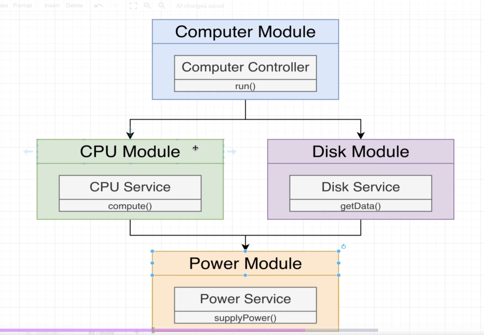
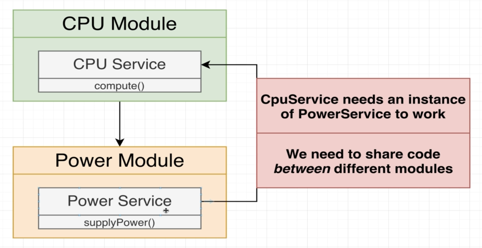
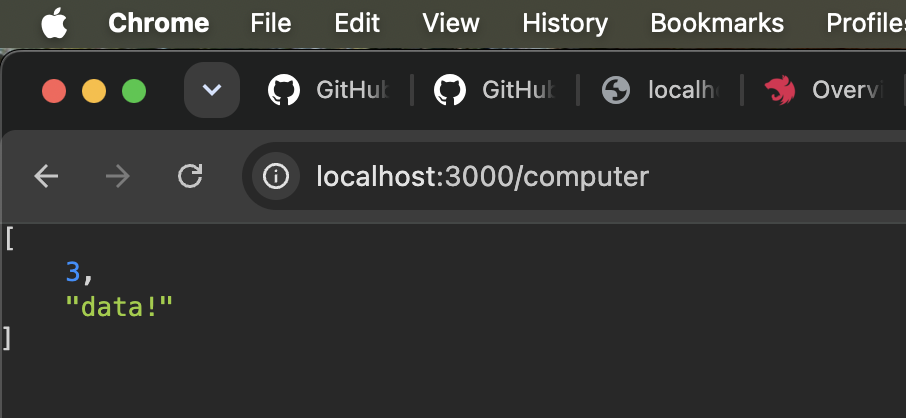
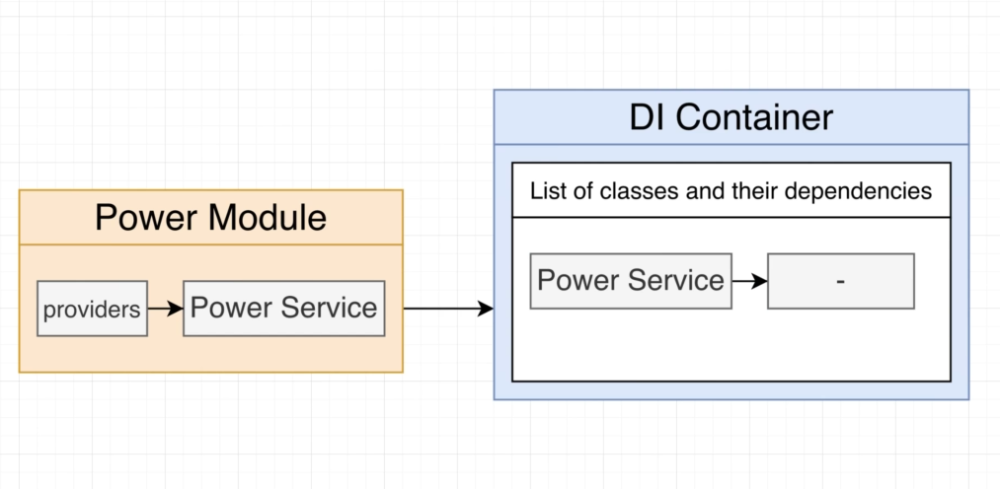
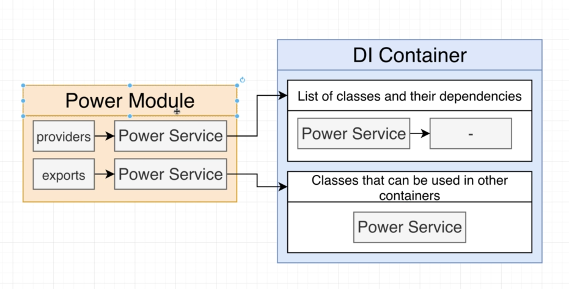
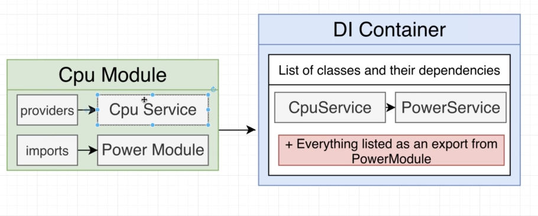

# Nest Architecture: Organizing Code with Modules

- [Nest Architecture: Organizing Code with Modules](#nest-architecture-organizing-code-with-modules)
  - [Project Overview](#project-overview)
  - [Generating a few modules](#generating-a-few-modules)
  - [Settings up DI Between Modules](#settings-up-di-between-modules)
    - [Objectives](#objectives)
    - [Dependency Injection inside of a module](#dependency-injection-inside-of-a-module)
    - [Dependency Injection Between Modules](#dependency-injection-between-modules)
  - [Modules Wrapup](#modules-wrapup)

## Project Overview

We will be mimiciking the Computer.

1. Computer has
   1. Power Supply
      1. CPU
      2. Disk

We will see how we will be modelling this.

1. `ComputerModule`
   1. Has `ComputerController::run()`
      1. Depends on
         1. `CPU Module`
            1. Has `CPUService::compute()`
         2. `Disk Module`
            1. Has `DiskService::getData()`
         3. Both `CPU Module` and `Disk Module`
            1. Depends on
               1. `Power Module`
                  1. Has `PowerService::supplyPower()`



We will understand
1. What modules are?
2. Why to use them?
3. And really good idea about rules of Dependency Injection

## Generating a few modules

1. We will remove all the files from inside the `/src` directory except for the `main.ts` file.
2. We will keep the `main.ts` file since all the bootstrapping code is present there.

We will now generate all of the 4 modules and the services for each one of them, and finally the controller.

1. Generating `ComputerModule`
   1. `nest generate module computer` OR `nest g module computer`
2. Generating the `CPUModule`
   1. `nest g module cpu`
   2. Generating the `CPUService`
      1. `nest g service cpu`
3. Generating the `DiskModule`
   1. `nest g module disk`
   2. Generating the `DiskService`
      1. `nest g service disk`
4. Generating the `PowerModule`
   1. `nest g module power`
   2. Generating the `PowerService`
      1. `nest g service power`
5. We finally generate the `ComputerController`
   1. `nest g controller computer`

We will also need to update the `main.ts` file.

```typescript
// file: src/main.ts
import { NestFactory } from '@nestjs/core';
import { ComputerModule } from './computer/computer.module';

async function bootstrap() {
  const app = await NestFactory.create(ComputerModule);
  await app.listen(process.env.PORT ?? 3000);
}
bootstrap();
```

The modules we have created,

1. `computer`
2. `disk`
3. `power`

are not connected in any way. We will be connecting these modules using a Bottom Up Approach.

We will go to that modules that does not depend upon anything else, the `PowerModule`

We will add the `supplyPower()` method to the `PowerService` class.

Our project really doesn't do anything per se, we will not be writing implementation, we will only see how the modules, services and controllers are wired up.

```typescript
// file: src/power/power.service.ts
import { Injectable } from '@nestjs/common';

@Injectable()
export class PowerService {
  supplyPower(watts: number) {
    console.log(`Supplying ${watts} worth of power.`);
  }
}
```

Now we need to make it accessible from the `CPUModule` and `DiskModule`.

## Settings up DI Between Modules

We will no worry about the relationship between the `CPUModule` and `PowerModule`.



### Objectives

1. The `CpuService` needs an instance of the `PowerService` to work.
2. We need to share code between different modules.

Sharing services between different modules will be a bit different than sharing code inside a module.

### Dependency Injection inside of a module

Inside a module if a service depends on another service, we make use of the `@Injectable()` decorator and add a constructor accepting the dependent class object as a parameter in the class in that depends on this class.

1. `PowerModule` contains
   1. `PowerService::supplyPower()` --> `RegulatorService::regulatePower()`
   2. The `RegulatorService` requires an instance of the `PowerService` to work.

Following steps needs to be followed to make the above work.

1. Add the `@Injectable()` decorator to `PowerService`.
2. Add the `PowerService` to the `PowerModule`'s list of providers.
3. Define the constructor method on `RegulatorService` and add `PowerService` to it.

### Dependency Injection Between Modules

When a service in a module depends on a service from another module, then we need to export the service from Module A, and import Module A into Module B through the dependents, and then similar to above add a constructor accepting the object of another service.

1. `PowerModule` contains
   1. `PowerService::supplyPower()`
2. `CPUModule`
   1. `CpuService::compute()`

Following steps needs to be followed to make the above work.

1. Add `PowerService` to the `PowerModule`'s list of exports, inside the `@Module()` decorator

```typescript
// file: src/power/power.module.ts

import { Module } from '@nestjs/common';
import { PowerService } from './power.service';

@Module({
  // By default, the PowerService cannot be accessed
  // by  any other module
  providers: [PowerService],

  // Through this, we explicitly want to make this
  // class available to the other modules.
  exports: [PowerService],
})
export class PowerModule {}
```

2. Import the `PowerModule` into the `CpuModule`.

```typescript
// file: src/cpu/cpu.module.ts

import { Module } from '@nestjs/common';
import { CpuService } from './cpu.service';
import { PowerModule } from '../power/power.module';

@Module({
  imports: [PowerModule],
  providers: [CpuService],
})
export class CpuModule {}
```

3. Define the constructor method on `CpuService` and add `PowerService` to it.

```typescript
// file: src/cpu/cpu.service.ts

import { Injectable } from '@nestjs/common';
import { PowerService } from '../power/power.service';

@Injectable()
export class CpuService {
  constructor(private powerService: PowerService) {}
}
```

This is how we setup DI between different modules. This is how we share the services between different modules.

This is how we are making use of the `PowerService` inside the `CPUService`

```typescript
// file: src/cpu/cpu.service.ts

import { Injectable } from '@nestjs/common';
import { PowerService } from '../power/power.service';

@Injectable()
export class CpuService {
  constructor(private powerService: PowerService) {}

  compute(a: number, b: number) {
    console.log('Drawing 10 watts of power from Power Service');
    this.powerService.supplyPower(10);
    return a + b;
  }
}
```

Now, we will give the `DiskModule` access to the `PowerModule`.

We already added `PowerService` to the list of exports inside the `PowerModule`.

1. `providers`
   1. The classes / services added inside this list is accessible through out the module.
2. `exports`
   1. The classes / services added inside this list is accessible to other modules.

Now we make sure to import the `PowerModule` inside the `DiskModule`.

```typescript
// file: src/disk/disk.module.ts

import { Module } from '@nestjs/common';
import { DiskService } from './disk.service';
import { PowerModule } from '../power/power.module';

@Module({
  imports: [PowerModule],
  providers: [DiskService],
})
export class DiskModule {}
```

Now we add the `PowerService` class object in the constructor of the `DiskService`.

```typescript
// file: src/disk/disk.service.ts

import { Injectable } from '@nestjs/common';
import { PowerService } from '../power/power.service';

@Injectable()
export class DiskService {
  constructor(private powerService: PowerService) {}

  getData() {
    console.log('Drawing 20 watts of power from PowerService');
    this.powerService.supplyPower(20);
    return `data!`;
  }
}
```

Now that we have connected the, `PowerModule` to both the `CPUModule` and `DiskModule`, we will now have to connect both the

1. `CPUModule` and
2. `DiskModule`

to the `ComputerModule`.

Since the `ComputerModule` needs a copy of the `CPUService` and `DiskService` we need to do the following steps.

1. Make sure that `CPUService` is exportable from the `CPUModule`.
   1. Unless we explicitly export a service from a module, it remains private in the entire project.

```typescript
// file: src/cpu/cpu.module.ts
import { Module } from '@nestjs/common';
import { CpuService } from './cpu.service';
import { PowerModule } from '../power/power.module';

@Module({
  imports: [PowerModule],
  providers: [CpuService],
  exports: [CpuService], // <-- Exported the `CpuService`
})
export class CpuModule {}
```

1. Make sure that `DiskService` is exportable from the `DiskService`.

```typescript
// file: src/disk/disk.module.ts

import { Module } from '@nestjs/common';
import { DiskService } from './disk.service';
import { PowerModule } from '../power/power.module';

@Module({
  imports: [PowerModule],
  providers: [DiskService],
  exports: [DiskService] // <-- NEW
})
export class DiskModule {}
```

3. Import the `CPUModule` and `DiskModule` inside the `ComputerModule`.
   1. Please note that we don't have to import the `PowerModule` since it is not a direct dependency of the `ComputerModule`. It will be used internally by the `CPUModule` and `DiskModule`, the `ComputerModule` does not have to think about this.

```typescript
// file: src/computer/computer.module.ts

import { Module } from '@nestjs/common';
import { ComputerController } from './computer.controller';
import { CpuModule } from '../cpu/cpu.module';
import { DiskModule } from '../disk/disk.module';

@Module({
  imports: [CpuModule, DiskModule],
  controllers: [ComputerController],
})
export class ComputerModule {}
```

4. Inside the `ComputerController` accept the objects of the `CPUService` and `DiskService`.

```typescript
// file: src/computer/computer.controller.ts

import { Controller, Get } from '@nestjs/common';
import { CpuService } from '../cpu/cpu.service';
import { DiskService } from '../disk/disk.service';

@Controller('computer')
export class ComputerController {
  constructor(
    private cpuService: CpuService,
    private diskService: DiskService,
  ) {}

  @Get('run')
  run() {}
}
```

5. Make use of them inside the `run()` method.

```typescript
// file: src/computer/computer.controller.ts

import { Controller, Get } from '@nestjs/common';
import { CpuService } from '../cpu/cpu.service';
import { DiskService } from '../disk/disk.service';

@Controller('computer')
export class ComputerController {
  constructor(
    private cpuService: CpuService,
    private diskService: DiskService,
  ) {}

  @Get()
  run() {
    return [this.cpuService.compute(1, 2), this.diskService.getData()];
  }
}
```

OUTPUT:



## Modules Wrapup

Inside the `PowerModule` when we add the `PowerService` to the `providers` array.

```typescript
@Modules({
  providers: [PowerService]
})
```

This is how the DI system sets itself up.



Now, when we add the `PowerService` to the list of `exports` of a module, this is the new state of the DI container.



Now, when we import the `PowerModule` inside the `CPUModule`, the DI container sets up these objects for access inside the `CPUModule`.



Everything listed in the export of the `PowerModule` is made accessible inside the `CPUModule`.

This modular design of Nest JS is what will enable us to define clean boundaries across the modules, the services of the modules that can be accessed.