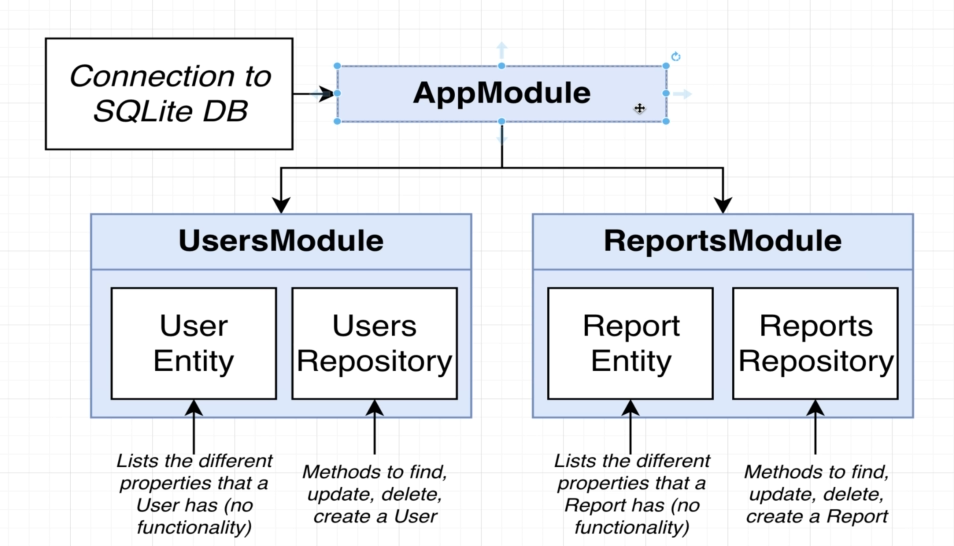
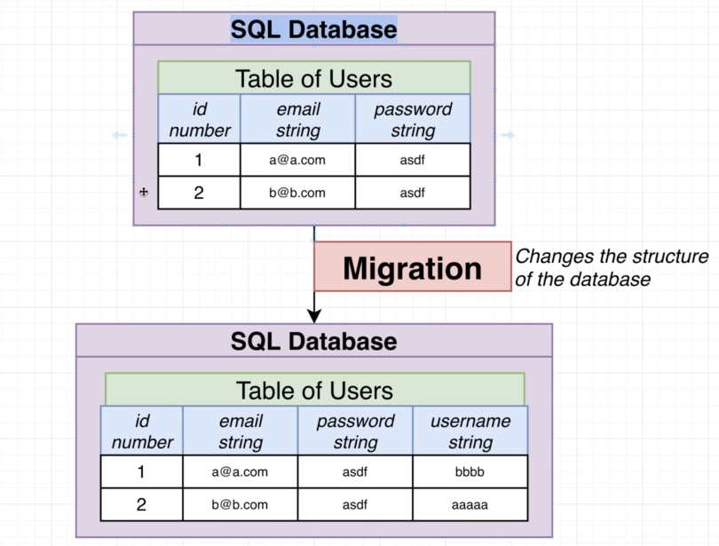
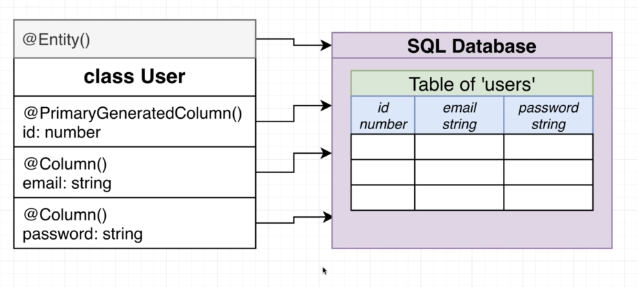

# Used Car Pricing API

- [Used Car Pricing API](#used-car-pricing-api)
  - [Project Overview](#project-overview)
  - [Generate a new Nest Project](#generate-a-new-nest-project)
  - [Design of our application](#design-of-our-application)
  - [Generating the Modules](#generating-the-modules)
  - [Persisting Data in Nest](#persisting-data-in-nest)
  - [Creating an Entity and Repository](#creating-an-entity-and-repository)
  - [Understanding TypeORM Decorators](#understanding-typeorm-decorators)
  - [One Quick Note on the Repositories](#one-quick-note-on-the-repositories)

## Project Overview

1. Users sign up with email/password
2. Users get an estimate for how much their car is worth based on the
   1. Make
   2. Model
   3. Year
   4. Mileage
3. Users can report what they sold their vehicles for
4. Admins have to approve reported sales
   1. To prevent abuse, the admins will review all the reports from Step #3, so that frivolous car sold amounts do not end-up in our data set.
   2. Whenever the users report a car being sold, the admin will have to approve the reported sales.

## Generate a new Nest Project

1. We generate a new project
   1. `nest new my-car-value`
   2. Select `pnpm` as the package manager
2. We change directory to `cd my-car-value`
3. Run `pnpm approve-builds` and approve all the builds

## Design of our application

Functional Requirements have been mapped to their corresponding API's.

1. **Users sign up with email/password**
   1. Sign Up Route
      1. Method and Route:
         1. POST `/auth/signup`
      2. Body or Query String
         1. Body - `{ email, password }`
      3. Description
         1. Create a new user and sign in
   2. Sign In Route
      1. Method and Route:
         1. POST /auth/signin
      2. Body or Query String
         1. Body - `{ email, password }`
      3. Description
         1. Sign in as an existing user
2. **Users get an estimate for how much their car is worth**
   1. Fetch Reports
      1. Method and Route:
         1. GET /reports
      2. Body or Query String
         1. QS - make, model, year, mileage, longitude, latitude
      3. Description
         1. Get an estimate for the cars value
3. **Users can report what they sold their vehicles for**
   1. Create Report Price
      1. Method and Route:
         1. POST /reports
      2. Body or Query String
         1. Body - `{ make, model, year, mileage, logitude, latitide, price }`
      3. Description
         1. Report how much a vehicle is sold for
4. **Admins have to approve reported sales**
   1. Approve the Submitted Report Price
      1. Method and Route:
         1. PATCH /reports/:id
      2. Body or Query String:
         1. Body - `{ approved }`
      3. Description
         1. Approve or reject a report submitted by a user

We might need to add some other API's as required.

Now we will see what the different

1. Controllers
2. Services
3. Repositories
4. Models
5. Entities

will be needed in this app.

We have two general goals in our app.

1. We have routes handling authentication.
   1. `Users Module`
      1. Controllers
         1. Users Controller
      2. Services
         1. Users Service
      3. Repositories
         1. Users Repository
2. We have routes handling the fetching and updating of reports.
   1. `Reports Module`
      1. Controllers
         1. Reports Controller
      2. Services
         1. Reports Service
      3. Repositories
         1. Reports Repository

When starting out any app, identify the different resources present in the app. Once we have identified the different resources, we can generally assume, we will have a Controller, Service and a Repository for each of the different resources, and then group them inside separate modules.

Each reosurce has its own module, which inturn contains Controllers, Services and Repositories.

We will use a real DB from the repositories.

## Generating the Modules

Please note, we DO NOT Use the Nest CLI to generate the repositories for us. Repositories are almost always going to be different depending on how we store the data. So, we don't generate them.

We only generate the

1. Controllers and 
2. Services

through the Nest CLI.

1. Creating the module
   1. `nest g module users`
   2. `nest g module reports`
2. Creating the controllers
   1. `nest g controller users`
   2. `nest g controller reports`
3. Creating the services
   1. `nest g service users`
   2. `nest g service reports`

If we open the `app.module.ts` we should see all the 

1. `Users`
2. `Reports`

module, have been imported.

## Persisting Data in Nest

Now we will be creating the repositories.

Nest works fine with any ORM, but works well out of the box with `TypeORM` and `Mongoose`.

`TypeORM` can interface directly with the following databases.

1. SQLite
2. Postgres
3. MySQL
4. MongoDB

`Mongoose` can interface only with the following DB

1. MongoDB

We will focus on the `TypeORM` which works very well with NestJS.

For right now, for ease of setup we will interface TypeORM with SQLite.

Eventually, we will swap out SQLite with Postgres.

We will install the `TypeORM` library.

`pnpm install @nestjs/typeorm typeorm sqlite3`

These are three separate libraries

1. @nestjs/typeorm
2. typeorm
3. sqlite3

This is what will be happening behind the scenes in our app.



1. Connection to SQLite DB will live inside the `AppModule`
   1. When we create a SQLiteDB connection inside the `AppModule` that connection will be shared down to all the other modules present in the app.
   2. A singleton connection to the SQLiteDB will remain.
2. The `UsersModule` will contain the following parts
   1. User Entity
      1. Lists the different properties that a User has (no funtionality)
      2. User probably should have
         1. email - string
         2. password - string
   2. Users Repository
      1. Methods to find, update, delete and create a user
      2. This will be automatically created for us, when using TypeORM
3. The `ReportsModule` will contain the following parts
   1. Report Entity
      1. Lists the different properties that a Report has (no functionality)
   2. Reports Repository
      1. Methods to find, update, delete, and create a report.
      2. This will be automatically created for us, when using TypeORM

The Entity in NestJS is similar to a Model with very subtle differences.

1. An entity file defines a single kind of resource, or single kind of thing that we want to store in our application.

When we are using TypeORM, we do not need to create the repositories manually, they are automatically created for us for the DB access.

We don't even end up seeing them as generated files, they are simply available for us to use.

For any other kind of data, we have to create our own repositories, like the in the previous applications.

We need to follow these steps to make use of TypeORM.

1. Create the SQLite DB connection inside the `app.module.ts`

```typescript
// file: src/app.module.ts

import { Module } from '@nestjs/common';
import { TypeOrmModule } from '@nestjs/typeorm';
import { AppController } from './app.controller';
import { AppService } from './app.service';
import { UsersModule } from './users/users.module';
import { ReportsModule } from './reports/reports.module';

@Module({
  // Setting up connection to the SQLite DB.
  // This connection will be automatically shared down
  // to all the other modules inside our project
  // ex. UsersModule and ReportsModule
  imports: [
    UsersModule,
    ReportsModule,
    TypeOrmModule.forRoot({
      type: 'better-sqlite3',
      database: 'db.sqlite',
      entities: [],
      synchronize: true,
      enableWAL: true,
    }),
  ],
  controllers: [AppController],
  providers: [AppService],
})
export class AppModule {}
```

After running this, it creates a `db.sqlite` file in the root directory, this stores all the data.

Now, we can open up that file and see the raw data using different tools like DB Browser for SQLite3, and see all the data of our application.

## Creating an Entity and Repository

We will create the entity file. TypeORM and Nest will automatically create repositories around these entities.

TypeORM will do a lot of setup for us, and help us persist the data.

Steps to create the entity.

1. Create an entity file, and create a class in it that lists all properties that your entity will have.

```typescript
// file: src/users/user.entity.ts

// These decorators help TypeORM understand all the
// different columns in our entity.
import { Entity, Column, PrimaryGeneratedColumn } from 'typeorm';

// By convention, we leave off the type of the class
// for the Entity.
@Entity()
class User {
  @PrimaryGeneratedColumn()
  id: number;

  @Column()
  email: string;

  @Column()
  password: string;

  constructor(id: number, email: string, password: string) {
    this.id = id;
    this.email = email;
    this.password = password;
  }
}

export { User };
```

2. Connect the entity to its parent module. This creates a repository.

```typescript
// file: src/users/users.module.ts

import { Module } from '@nestjs/common';
import { TypeOrmModule } from '@nestjs/typeorm';
import { UsersController } from './users.controller';
import { UsersService } from './users.service';
import { User } from './user.entity';

@Module({
  // The TypeOrmModule.forFeature() is what
  // creates the repository.
  imports: [TypeOrmModule.forFeature([User])],
  controllers: [UsersController],
  providers: [UsersService],
})
export class UsersModule {}
```

3. Connect the entity to the root connection (in app module).

```typescript
// file: src/app.module.ts

import { Module } from '@nestjs/common';
import { TypeOrmModule } from '@nestjs/typeorm';
import { AppController } from './app.controller';
import { AppService } from './app.service';
import { UsersModule } from './users/users.module';
import { ReportsModule } from './reports/reports.module';
import { User } from './users/user.entity'; // <-- This was newly added

@Module({
  // Setting up connection to the SQLite DB.
  // This connection will be automatically shared down
  // to all the other modules inside our project
  // ex. UsersModule and ReportsModule
  imports: [
    UsersModule,
    ReportsModule,
    TypeOrmModule.forRoot({
      type: 'better-sqlite3',
      database: 'db.sqlite',
      entities: [User], // <-- This was newly added
      synchronize: true,
      enableWAL: true,
    }),
  ],
  controllers: [AppController],
  providers: [AppService],
})
export class AppModule {}
```

We will be repeating the same thing for the Report entity.

```typescript
// file: src/reports/report.entity.ts

import { Entity, Column, PrimaryGeneratedColumn } from 'typeorm';

// make, model, year, mileage, longitude, latitude

@Entity()
class Report {
  @PrimaryGeneratedColumn()
  id: number;

  @Column()
  price: number;

  constructor(id: number, price: number) {
    this.id = id;
    this.price = price;
  }
}

export { Report };
```

Now, we will register this entity in the `report.module.ts` file. Here, we pass the entity class to TypeORM and in turn it gives us a repository for that entity.

```typescript
// file: src/reports/report.module.ts

import { Module } from '@nestjs/common';
import { ReportsController } from './reports.controller';
import { ReportsService } from './reports.service';
import { TypeOrmModule } from '@nestjs/typeorm';
import { Report } from './report.entity';

@Module({
  // Following line of code creates the repository
  imports: [TypeOrmModule.forFeature([Report])],
  controllers: [ReportsController],
  providers: [ReportsService],
})
export class ReportsModule {}
```

And now we need to register this in the `app.module.ts`

```typescript
// file: src/app.module.ts

import { Module } from '@nestjs/common';
import { TypeOrmModule } from '@nestjs/typeorm';
import { AppController } from './app.controller';
import { AppService } from './app.service';
import { UsersModule } from './users/users.module';
import { ReportsModule } from './reports/reports.module';
import { User } from './users/user.entity';
import { Report } from './reports/report.entity';

@Module({
  // Setting up connection to the SQLite DB.
  // This connection will be automatically shared down
  // to all the other modules inside our project
  // ex. UsersModule and ReportsModule
  imports: [
    UsersModule,
    ReportsModule,
    // This makes the DB available to all
    // the modules, which we makle use of inside the
    // respective modules to get the corresponding 
    // repository
    TypeOrmModule.forRoot({
      type: 'better-sqlite3',
      database: 'db.sqlite',
      entities: [User, Report],
      synchronize: true,
      enableWAL: true,
    }),
  ],
  controllers: [AppController],
  providers: [AppService],
})
export class AppModule {}
```

We now want to take a look at the contents of the SQLite file.

We can use the following extension on VSCode to browse the SQLite file.

https://marketplace.visualstudio.com/items?itemName=alexcvzz.vscode-sqlite

We can then press `Cmd/Ctr` + `P`, and type SQLite, and then Open Database, and select the `db.sqlite` file.

Then in the bottom of the File Explorer in VSCode we cna see the SQLITE EXPLORER tab.

We can alternatively also make use of `DB Browser for SQLite`

## Understanding TypeORM Decorators

```typescript
TypeOrmModule.forRoot({
  type: 'better-sqlite3',
  database: 'db.sqlite',
  entities: [User, Report],
  synchronize: true,
  enableWAL: true,
})
```

1. `type: 'better-sqlite3'`
   1. This denotes the type of database that we want to use. Right now, we are using SQLite
2. `database: 'db.sqlite'`
   1. The DB file where the data will be stored
3. `entities: [User, Report]`
   1. The entities / tables that we want to store in the DB.
4. `synchronize: true`
   1. What does this do? See below.

Consider the following diagram.



Let's say, we have an existing table `Users` in our table with the following columns

1. id: number
2. email: string
3. password: string

Now if we want to add another column to this table called `username: string`, then we would have to run something called a Migration, which changes the structure of the database.

1. It might change the name of the column
2. Add a brand new table
3. Add a new column
4. Drop a column etc.

This migration would be a SQL code, which would run on the entire DB and would automatically add/remove column or table inside the DB.

When we created our `User` and `Report` entities, we did not run any kind of migration for these tables to be created in the DB manually.

TypeORM has a very special feature, called `synchronize: true`, which automatically performs this migration for us.

This feature is only supposed to be used in the `development` environment. This option when set to true, will cause the TypeORM to automatically compare the structure of the DB and compare it with the entity structure and automatically perform the migration (add or remove columns, and also change the data type of the columns).

Let's take a look at the User entity.

```typescript
@Entity()
class User {
  @PrimaryGeneratedColumn()
  id: number;

  @Column()
  email: string;

  @Column()
  password: string;

  constructor(id: number, email: string, password: string) {
    this.id = id;
    this.email = email;
    this.password = password;
  }
}
```

Let us see how this corresponds to a table in the SQL DB.

TypeORM needs to be create a table to model this class around this Entity.

1. The table name would be `user`.
2. The `@PrimaryGeneratedColumn() id` will cause TypeORM to create a column called `id` with the type `NUMBER AUTO INCREMENT`
3. The `@Column() email: string` and `@Column() password: string` will correspond to
   1. `email VARCHAR` and `password VARCHAR`
   2. respectively in the table.



If we make any changes to the entity, and we restart our app, then TypeORM will see the type changes and perform the migrations automatically (update automatically).

Most SQL ORM don't really behave in this fashion. Often we have to write the migration files ourselves.

It's extremely important that we do not run the `synchronize: true` in a production environment, because it's very easy for the synchronize feature to delete a column, due to a bug, therefore we will need to run the migrations ourselves.

During development, it saves us a lot of time.

## One Quick Note on the Repositories

We now have access to the Users Repository and the Reports Repository, due to TypeORM, and we can now make use of Dependency Injection to get access to these repositories.

We will use these repositories, to create, read,update and delete the data.

Following is the [`Repository API`](typeorm.io/#/repository-api) of TypeORM.

1. `create()`
   1. Makes a new instance of an entity. but does not persist it to the DB.
2. `save()`
   1. Adds or updates a record to the DB
3. `find()`
   1. Runs a query and returns a list of entities.
4. `findOne()`
   1. Run a query, returning the first record matching the search criteria.
5. `remove()`
   1. Remove a record from the DB.

If we go through the documentation, there are some methods that are very very similar in nature.

1. `save()` is similar in behavior to `insert()` and `update()`
2. `remove()` is similar in behavior to `delete()`

In this library, there are more than one way to do something, like creating the repository, there exists 3 different ways.

As we read the documentaiton, we will get to know about the different things the library allows us to do. We kind of have to understand the behind the scene details to understand when to use what.

We wil make use of the `UsersService` to make use of the repository.